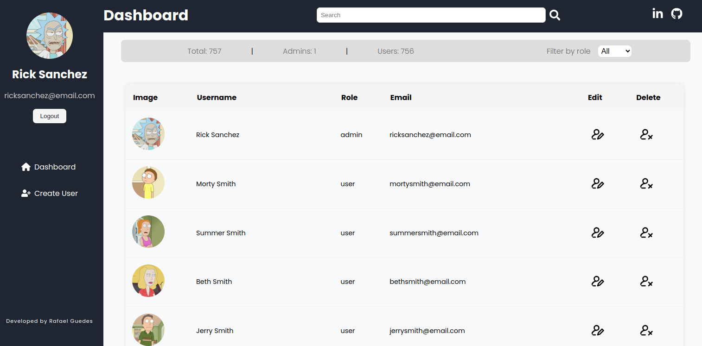
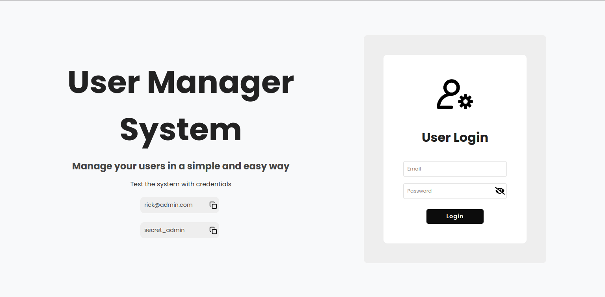
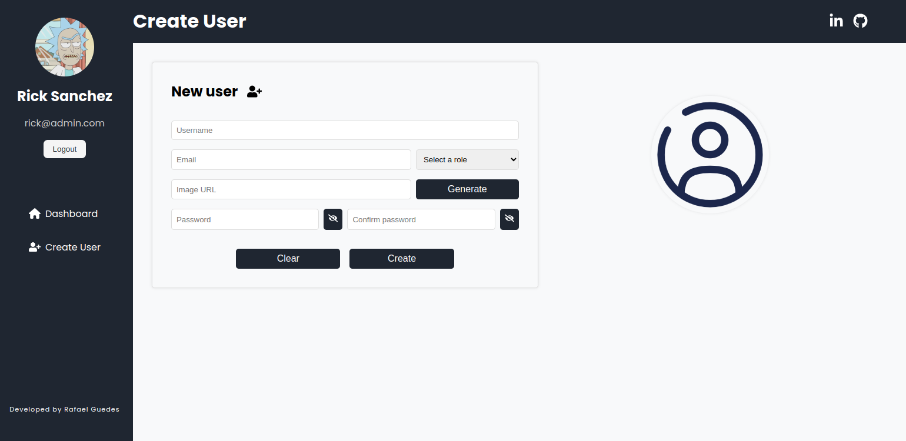

<h1 align="center">Authentication Microservice 👥</h1>

<p align="center">
  
  
  
  
  
  
  
</p>

<p align="center">
  
  
  
  
</p>

<p align="center">
  
  
  
  
</p>

<br />

<p align="center">
  
</p>

<br /><br />

## ➡️ About

<p>
  Authentication Microservice provides features such as user authentication, profile management and role-based access control. The application is built with a focus on security and performance, ensuring that user data is protected while delivering a smooth user experience.
</p>

<br />

## ➡️ Technologies

- Backend
  - Node, Express, TypeScript, JWT, PostgresSQL, Redis, Docker, Mocha, Sinon, Chai

- Frontend
  - React, TypeScript, Vite, Vitest, Styled Components, Hooks

- Deploy
  - Vercel and Railway

<br />

## ➡️ Usage

1. Clone the project

2. Inside of root project, <strong>run npm install:apps</strong>

3. Run docker containers backend, Redis and database: <strong>npm run compose:up</strong>

4. Run frontend: <strong>npm run dev</strong>

<br />

## ➡️ Tests Coverage
```
1. Backend - Go to app/backend and run: npm run test:coverage or npm run test

2. Frontend - Go to app/frontend and run: npm run coverage or npm run test
```

<br />

## ➡️ API Endpoints

### ▶️ Login
```
- POST /login - User login app

- GET /login/role - Get user role - (requires authorization)
```

### ▶️ User
```
- POST /user - Create a new user

- GET /user - Read a list of all users - (requires authorization)

- PUT /user/:id - Update a user - (requires authorization)

- DELETE /user/:id - Delete a user - (requires authorization)
```

<br />

## ➡️ ScreenShots

## ▶️ Login 



<br />

## ▶️ Dashboard


<br />

## ▶️ Create User


<br />

## ▶️ Update User


<br />

## ▶️ Delete User


<br />

## ▶️ Tests Backend Coverage (Unit and Integration tests)

