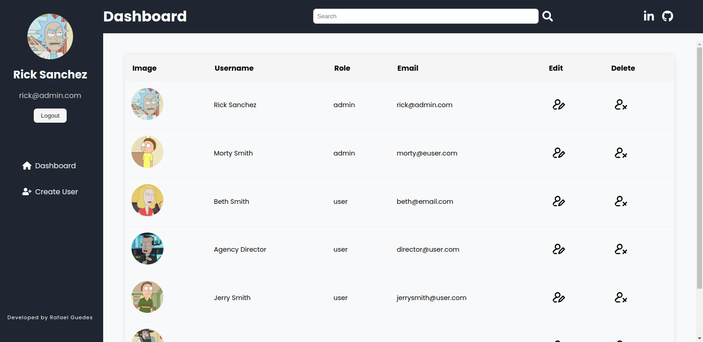
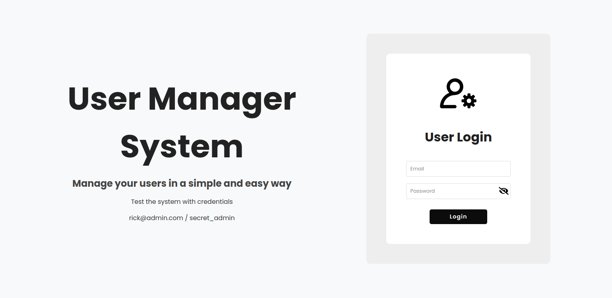
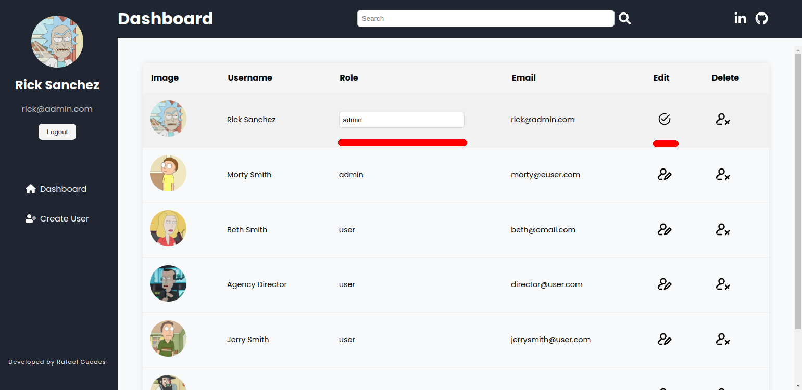
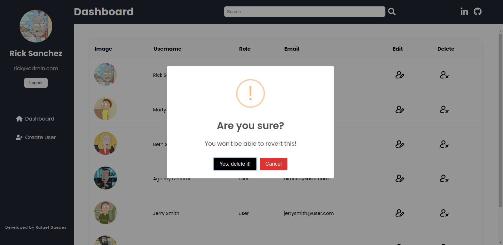
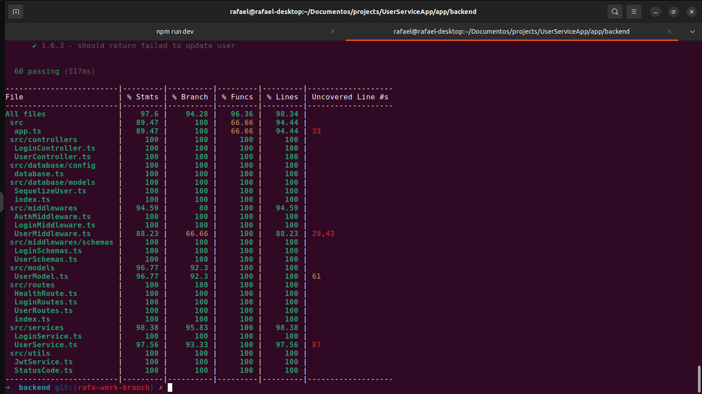

<div style="display:flex;flex-direction:column;justify-content:center;align-items:center;">
  <h1 align="center">User Service API</h1>
  
  <br />
  
  <br />
  <br />

</div>

<p>
  The User Service API provides features such as user authentication, profile management, role-based access control, and user analytics. The application is built with a focus on security and performance, ensuring that user data is protected while delivering a smooth user experience.
</p>

<br />

## ➡️ Technologys

- Backend
  - Node, Express, TypeScript, JWT, Mocha, Sinon, Chai, PostgresSQL, Docker

- Frontend
  - React, TypeScript, Vite, Vitest, Styled Components, Hooks

- Deploy
  - Vercel and Railway

<br />

## ➡️ Usage

1. clone the project

2. Inside of root project, <strong>run npm install:apps</strong>

3. Run docker containers backend and database: <strong>npm run compose:up</strong>

4. Run frontend: <strong>npm run dev</strong>

<br />

## ➡️ API Endpoints

### ▶️ Login
```
- POST /login - User login app

- GET /login/role - Get user role
```
### ▶️ User
```
- POST /user - Create a new user.

- GET /user - Read a list of all users.

- PUT /user/:id - Update a user.

- DELETE /user/:id - Delete a user
```
<br />

## ➡️ ScreenShots

## ▶️ Login 



<br />

## ▶️ Dashboard


<br />

## ▶️ Create User


<br />

## ▶️ Update User


<br />

## ▶️ Delete User


<br />

## ▶️ Tests Backend Coverage (Unit and Integration tests)
