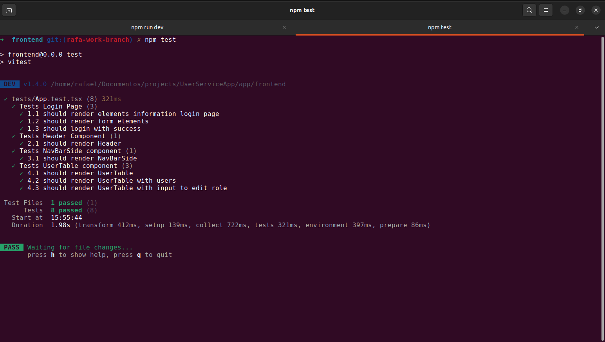

# User Service App

User Service App is a robust and scalable application designed to manage and handle user data efficiently. It provides features such as user authentication, profile management, role-based access control, and user analytics. The application is built with a focus on security and performance, ensuring that user data is protected while delivering a smooth user experience.

# Technologys

- Backend
  - Node, Express, TypeScript, JWT, Mocha, Sinon, Chai, PostgresSQL, Docker

- Frontend
  - React, TypeScript, Vite, Vitest, Styled Components, Hooks

- Deploy
  - Vercel and Railway

## Login 

## Dashboard

## Create User

## Update User

## Delete User

## Tests Backend Coverage (Unit and Integration tests)

## Tests Frontend Coverage (Unit tests)
