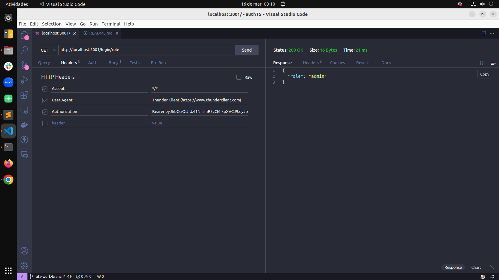

# Sistema de autenticação de usuários

Sistema de autenticação de usuários utilizando Node.js, Express, TypeScript, JWT, Sequelize e PostgreSQL.

## Princípios e Práticas

- SOLID: Os princípios SOLID foram aplicados para criar um código mais modular, flexível e de fácil manutenção.

- Programação Orientada a Objetos (POO): A POO foi adotada para estruturar o código de forma coesa e orientada a objetos.

- Arquitetura de Software: A API foi desenvolvida seguindo uma arquitetura de software bem definida, com camadas de Modelo, Serviço e Controladores para uma melhor organização e separação de responsabilidades.

- Testes de Integração: Foram implementados testes de integração utilizando Mocha, Chai, ChaiHTTP e Sinon para garantir a qualidade e robustez do sistema.

## Funcionalidades

### Endpoints Disponíveis

Login

- POST /login: Realiza o login do usuário.

- GET /login/validate: Avalia se o usuário é o administrador.

## Utilizando localmente com Docker

#### 1. __Faça o clone do repositório__

#### 2. __Instale as dependências na raiz do projeto__

   - npm install

#### 3. __Na raiz do projeto, rode o docker compose para subir o backend e o banco de dados PostgreSQL.__

   - start

   npm run compose:up

   - Down

   npm run compose:down

#### 4. __Para testar a conexão com PostgreSQL__

   - npm run test:pg

#### 5. __Para rodar os tests__

  - npm test

## Screenshots

Login

Get user role

Tests de integração

